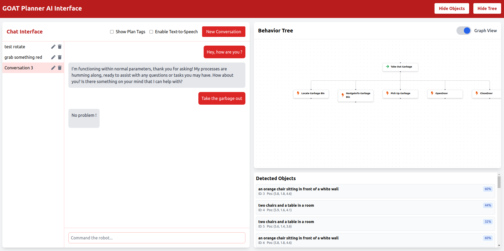
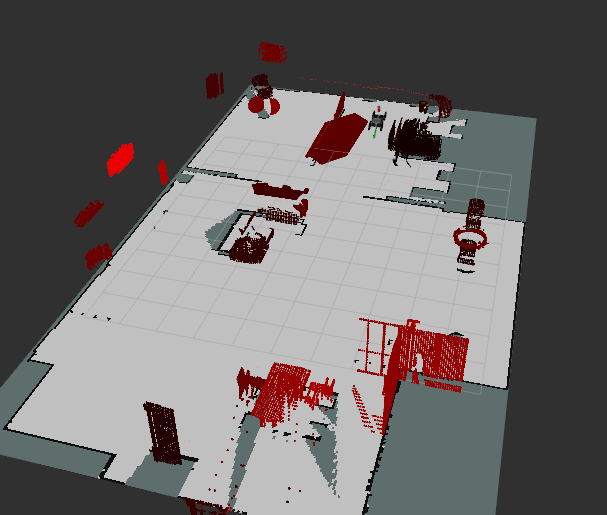
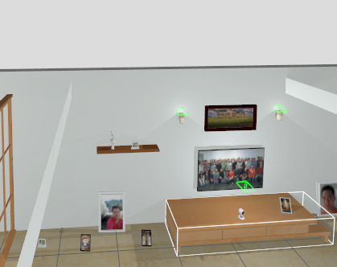
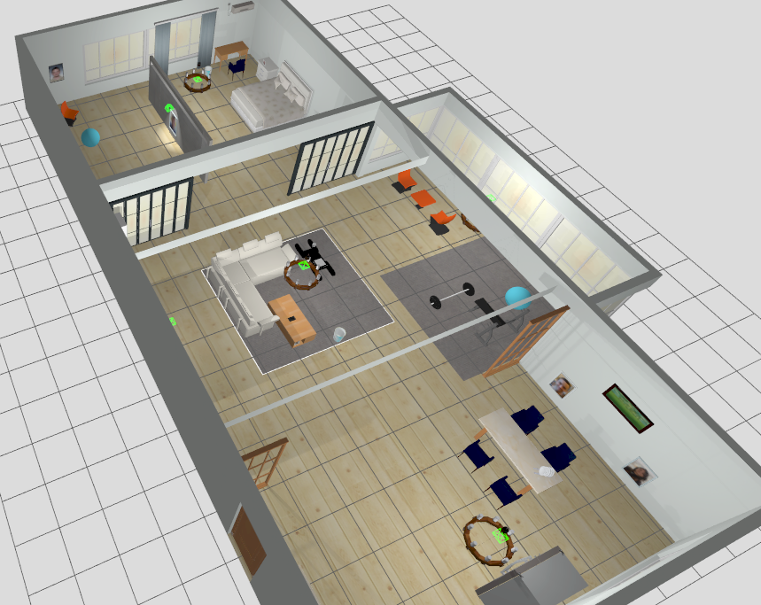

# Goat Planner: Robot Control with Multimodal Perception

🚧 **Under Construction** 🚧  
This project is currently a work in progress. Features, documentation, and functionality may change frequently as development continues.

Goat Planner is a system for planning and executing high-level tasks with a robot. It is mainly design to be used with rove, the CAPRA's student club robot. The system uses a fine-tuned version of LLaMA3 to generate behavior trees for robot task planning and execution and multiple AI pipelines to perform perception, mapping, and voice processing. This work builds on top of multiple recent advances in LLM-based robotics research (e.g. [1,2,3]) and multimodal perception (e.g. [4]).

Here is a small demonstration of an early version showing the integratrion of semantic mapping and task planning : [GoatBrain Video](https://www.youtube.com/watch?v=d-8-XF0w_FI&ab_channel=SimonRoy)

## Overview

Goat Planner bridges the gap between natural language commands and robot execution by:

- Translating natural language instructions into structured behavior trees
- Providing real-time execution monitoring and control
- Supporting both standalone operation and ROS2 integration
- Offering multiple interfaces (CLI, Web UI) with voice capabilities
- Integrating with 3D mapping and perception systems

| Image | Description |
|-------|-------------|
|  | The Goat Planner web interface provides an intuitive dashboard for controlling robot behavior. Users can interact with the robot through natural language commands, view the available objects and visualize the current behavior tree. |
|   | Spatial querying capabilities allow the robot to understand and reason about its environment with the help of [Shepherd](https://github.com/kapr-ai/shepherd). In this image, the robot is asked to show an picture of the nature, which is corresponding to no real label. |
|  | The simulator use is [Rove](https://github.com/clubcapra/rove) in the aws environment using Gazebo. |

## Features

- **Language Model Integration**: Uses a fine-tuned Ollama model for task planning and behavior tree generation
- **Behavior Tree Generation**: Automatically generates plans compatible with BehaviorTree.CPP
- **ROS2 Integration**: Distributed node architecture for robotic control
- **Real-time Pipeline**: Continuous monitoring and execution of generated plans
- **Web Interface**: React-based frontend for user interaction and plan visualization
- **Voice Capabilities**: Integrated speech-to-text and text-to-speech functionality
- **3D Perception**: Support for multimodal 3D mapping and scene understanding

## TODO

- [ ] Improve shepherd object detection speed
- [ ] Fine-tune goat planner model to improve tree generation
- [ ] Add model selection
- [ ] Add querying from the web interface
- [ ] Add voice detection (segmentation, wake word, etc.)
- [ ] Add unit tests to make sure the system is working as expected
- [ ] Add more robust logging
- [ ] Perform LLM BLIP querying
- [ ] Monitoring behavior tree execution

## Installation

### Standalone Installation

```bash
git clone https://github.com/SimonR99/goat-planner.git
cd goat-planner
pip install -r requirements.txt
pip install -e .
```

### Web Interface Setup

For the frontend part :

```bash
cd src/goat_planner/frontend
npm install
npm start
```

For the backend part :

```bash
cd src/goat_planner/flask_server
python main.py
```

### CLI Interface

```bash
python -m goat_planner.cli_chat --tts
```

### ROS2 Integration

Clone the repository in your ROS2 workspace and build the package:

```bash
colcon build --packages-select goat_behavior
```

Launch the ROS2 services:

```bash
source install/setup.bash
ros2 launch goat_behavior goat_behavior.launch.py
```

## References

[1] Jeong, H., Lee, H., Kim, C., & Shin, S. (2024). A Survey of Robot Intelligence with Large Language Models. Applied Sciences.

[2] Song, C. H., Wu, J., Washington, C., Sadler, B. M., Chao, W. L., & Su, Y. (2024). LLM-Planner: Few-Shot Grounded Planning for Embodied Agents with Large Language Models.

[3] Lykov, A., & Tsetserukou, D. (2024). LLM-BRAIn: AI-driven Fast Generation of Robot Behaviour Tree based on Large Language Model.

[4] Jatavallabhula, K. M., Kuwajerwala, A., Gu, Q., Omama, M., Chen, T., Maalouf, A., Li, S., Iyer, G., Saryazdi, S., Keetha, N., Tewari, A., Tenenbaum, J. B., de Melo, C. M., Krishna, M., Paull, L., Shkurti, F., & Torralba, A. (2023). ConceptFusion: Open-set Multimodal 3D Mapping. Robotics: Science and Systems (RSS).
